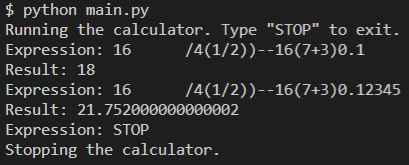

# Calculator

This was my attempt at creating an algebraic calculator. Currently, you input an expression and the program simplifies it down to a single number.

Features include:
* Input any expression with addition (+), subtraction (-), multiplication (*), and division (/)
* Grouping symbols ()
* Will use order of operations to simplify
    * Regardless of whitespace
* Enter 'ans' to use the previous answer or start the expression with an operator

Make sure [Python](https://www.python.org/downloads/ "Download Python from www.python.org") is installed on your device before opening this file.

Future updates will include:
* More operations
* A graphical user interface using Tkinter

## Credits

Alex Akoopie - Creator